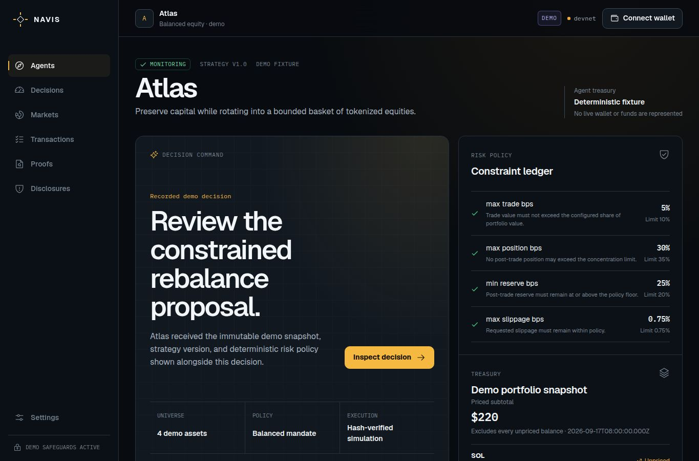

# Navis local QA

Verified: 2026-09-20.

After the separate local remediation pass, `npm run check` passed with 143 tests in 26 files, production build and eleven-route judge smoke. The restarted preview renders the revised receipt explanation. The broader public-browser checks below are baseline observations of the deployed commit, not a claim that local fixes are already live.

## Browser walkthrough

- A fresh real-Chromium browser completed the public Atlas → Inspect decision → actual public verifier journey.
- All requested pages loaded without application errors.
- Demo hashes validated. The receipt remained `offchain_only`, showed signature `None`, and exposed no explorer link.
- `/agents/new` accepted a valid mandate in review, displayed defaults, and kept save/link disabled without authentication. No write occurred.
- Ten UI routes at 375, 768, and 1440 px had no horizontal overflow or missing input labels.
- Keyboard menu Escape and focus return passed; contrast checks had no failures.
- Reduced-motion was effective, and Atlas remained usable without overflow at 200% CSS zoom.

Public and local machine-readable evidence is expected in `evidence/stocklana-public-smoke.json` and `evidence/stocklana-browser-audit.json` after the main release pass copies sanitized generated reports.

## Runtime nonce checks

- Same-origin request returned HTTP 200, `Cache-Control: no-store`, and a message bound to the exact preview HTTPS origin.
- Foreign `Origin` returned HTTP 403.
- Missing `Origin` returned HTTP 403.
- No secret values were printed.

## Limitations

- No real wallet extension, wallet signature, live transaction, or full screen-reader audit was tested. The public Vercel deployment and its health endpoint were tested.
- Fresh interactive proposal generation remains deferred and archived. The verified flow uses deterministic demo evidence.
- Replit `getDeploymentInfo` reports NOT published; this does not describe the separate READY Vercel deployment.
- `npm audit --omit=dev` still reports 19 unresolved production advisories: 6 high, 13 moderate, and 0 critical.
